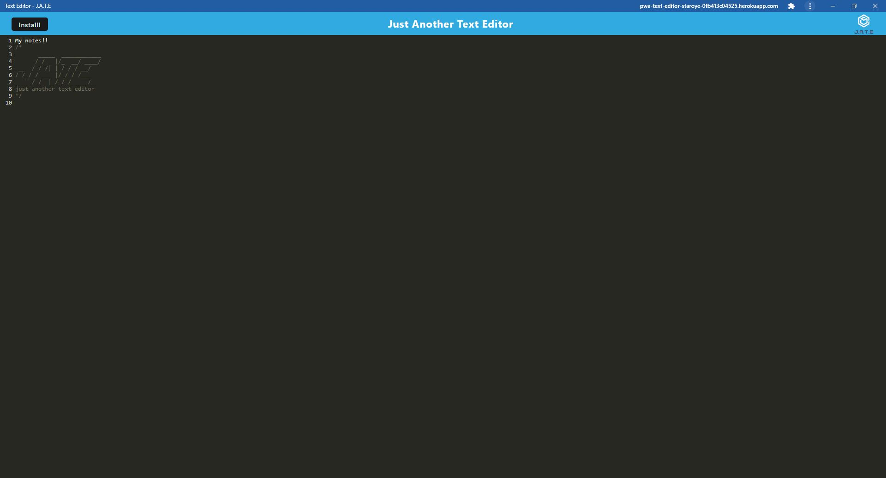

# PWA-text-editor

## Description

I was tasked to create a PWA text editor using webpack, serviceworkers, and IndexedDB.

I was motivated to undertake this task because I wished to gain a greater understanding of how to create a PWA and deploy it.

## Solve

The completion of this project provides the user with a text editor. This text editor allows the user to edit any text within the editor, leave/close the app and have the data persist, and install it onto their local machine.

## Installation

Steps to install this project on your local PC

1. Open the termal on your machine.
2. Use the terminal command `cd` to navigate to the directory where you want the repository located.
3. Locate the 'Code' button on the 'pwa-text-editor' github repository, click it, then copy the 'HTTPS' link to clipboard. (See image)

4. Use the git command `git clone` followed by the URL copied from Github to clone the repo to your machine.
5. The `git clone` command creates a new directory with the same name as the repository. Navigate into your new directory using `cd`.
6. The repository should now be cloned onto your device and able to be edited in VScode or another editing software.

## App Link
https://pwa-text-editor-staroye-0fb413c04525.herokuapp.com/

## Instructions

To use the app:

1. Follow the above link to the application.
2. Enter any text and edit.
3. (optional) install application onto your local machine.
4. Exit and re-open the application to see your text data persist.

## Screenshots
### Browser

### Installed App

## Resources

- Week 19 activities.
- https://www.npmjs.com/package/mongoose
- https://developer.chrome.com/docs/workbox/modules/workbox-routing/
- https://www.npmjs.com/package/webpack-pwa-manifest
- https://www.npmjs.com/package/idb
- https://developer.mozilla.org/en-US/docs/Web/API/IndexedDB_API/Using_IndexedDB
- https://developer.mozilla.org/en-US/docs/Web/API/IndexedDB_API
- https://developer.mozilla.org/en-US/docs/Web/API/IndexedDB_API/Basic_Terminology
- https://developer.chrome.com/docs/workbox/reference/workbox-build/#type-RuntimeCaching
- https://developer.chrome.com/docs/workbox/